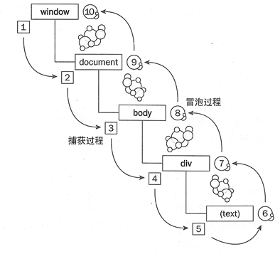

## 关于onclick和addEventListener的区别
  #### 1. onclick和addEventListener都可以用来为DOM元素添加事件监听器，但是它们之间存在一些关键的区别：
  1. 事件处理器的数量:
      - onclick属性在同一时间只能绑定一个事件处理器。如果你尝试再次赋值给onclick，前一个处理器会被覆盖。
      - addEventListener允许你为同一个元素的同一个事件类型添加多个事件处理器（如为click事件绑定多个事件处理器）。
  2. 事件流:
         
      - 使用onclick绑定的处理器默认是在事件冒泡阶段被调用。
      - addEventListener允许你指定事件处理器是在捕获阶段还是冒泡阶段被调用，通过传递第三个参数true(捕获阶段调用)或false(冒泡阶段调用)来控制。
      - 常见的冒泡事件有：鼠标事件(click、mouseover、mouseout等)、键盘事件(keydown、keyup等)、表单(change、submit等)事件等。
  3. 可移除性:
      - onclick绑定的处理器不能通过removeEventListener移除，因为它不是以标准的监听器形式添加的。
      - addEventListener添加的处理器可以通过removeEventListener移除，这使得在某些情况下更易于管理事件处理器的生命周期。
  
  #### 2. 事件委托
  1.  事件委托是使用事件冒泡机制来处理多个元素上的事件。在事件委托中，事件监听器不是直接绑定在目标元素上，而是绑定在其父元素或者更高级别的祖先元素上。当事件在目标元素上发生时，它会冒泡到其父元素，最终到达监听器所在的元素，这样就可以在该元素上处理所有子元素的事件，而无需为每个子元素单独绑定事件监听器。
  2.  事件委托的优势：
        性能提升：减少事件监听器的数量，特别是在大量动态生成的元素上，避免了为每一个元素都绑定监听器带来的内存消耗和性能开销。
        动态元素：即使DOM结构中动态添加或删除元素，事件委托仍然有效，因为监听器是绑定在静态的父元素上的，不需要重新绑定。
        简洁的代码：简化了事件绑定的代码，提高了代码的可维护性和可读性。
  3.  实现事件委托的步骤：
        选择代理元素：选择一个合适的父元素作为事件代理的目标，通常是最近的静态容器。
        绑定事件监听器：在代理元素上绑定事件监听器。
        检查事件目标：在事件处理器中，通过event.target获取实际触发事件的元素，并根据这个元素进行相应的逻辑处理。